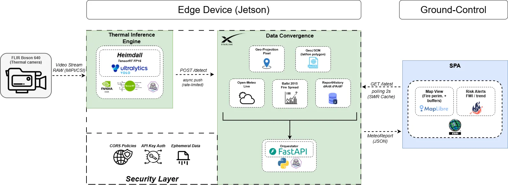

<div align="center">

# 🛰️ Heimdall — Edge AI for Situational Awareness in Emergencies

**Real-time wildfire situational awareness, from the edge to the command post.**
Detect fire on-device (NVIDIA Jetson + TensorRT), forecast its spread with physics — not a black box — and stream it to a 3D operations dashboard.

> 🏆 **Hackathon SEDIA · Reto IA Responsable y Abierta en Industria · Aragón, mayo 2026**

[](LICENSE)
[](NOTICE)
[](https://github.com/ComunidadIA-OS/Edge-AI-for-Situational-Awareness-in-Emergencies/releases/tag/Heimdall-Vision-TensorRT-F16)
[](https://www.python.org/)
[](https://www.nvidia.com/en-us/autonomous-machines/embedded-systems/jetson-orin/)
[](#-responsible-ai)

</div>

---

> **Resumen (ES).** Heimdall detecta incendios desde un dron con NVIDIA Jetson (modelo de visión térmica propio sobre TensorRT FP16), **predice la propagación del fuego con un modelo físico** (Balbi 2015) en lugar de una caja negra, y lo despliega en un dashboard 3D para los equipos de respuesta. El sistema es **siempre asesor, nunca autónomo**: toda salida requiere validación humana.

## Table of contents

- [Why Heimdall](#why-heimdall)
- [Architecture](#architecture)
- [Repository layout](#repository-layout)
- [Quick start](#quick-start)
- [The vision model](#the-vision-model)
- [Documentation](#documentation)
- [Roadmap](#roadmap)
- [Responsible AI](#-responsible-ai)
- [Authors](#authors)
- [License](#license)
- [Citation](#citation)

## Why Heimdall

Emergencies move faster than humans can process raw video feeds. Heimdall closes that gap at the edge: a drone sees fire, and within seconds the command post sees **where it will be**, not just where it is.

The design choice that matters: in the safety-critical path, propagation is computed with an **explainable physical model** (Balbi rate-of-spread + standard fuel models), not an opaque end-to-end network. Machine learning is confined to **perception** (detecting fire in thermal imagery); the **forecast** is physics and doctrine you can audit, cite, and defend. Every output is advisory and requires a human in the loop.

## Architecture



Two services communicate over a typed REST contract (`MeteoReport`): the **vision** service posts detections; the **convergence** service enriches them with a physics-based spread forecast; the **dashboard** renders the result.

## Repository layout

The project is split across three branches, one per deployable surface. Each branch is self-contained and documented:

| Branch | Surface | Stack | Open it |
|--------|---------|-------|---------|
| **`v0.1-Heimdall`** (this branch, default) | Project hub + monorepo structure | — | you are here |
| **[`v0.1-EdgeDevice`](../../tree/v0.1-EdgeDevice)** | Jetson edge stack: vision + convergence | Python 3.10+, FastAPI, TensorRT, Ultralytics | edge AI |
| **[`v0.1-GroundControl`](../../tree/v0.1-GroundControl)** | Operations dashboard | Next.js, TypeScript, MapLibre GL, Deck.gl | dashboard |

```
heimdall/                 # monorepo structure (this branch)
├── packages/
│   ├── edge/             # Jetson edge stack  → see branch v0.1-EdgeDevice
│   └── ground-control/   # Ground Control      → see branch v0.1-GroundControl
├── CONTRIBUTING.md · CODE_OF_CONDUCT.md · SECURITY.md · CHANGELOG.md
├── CITATION.cff · LICENSE · NOTICE
└── package.json          # pnpm workspace
```

## Quick start

```bash
git clone https://github.com/ComunidadIA-OS/Edge-AI-for-Situational-Awareness-in-Emergencies.git
cd Edge-AI-for-Situational-Awareness-in-Emergencies
```

- **Edge stack (Jetson, one-command deploy):** `git checkout v0.1-EdgeDevice` and follow its [README](../../tree/v0.1-EdgeDevice) / [howRun.md](../../tree/v0.1-EdgeDevice/howRun.md).
- **Dashboard:** `git checkout v0.1-GroundControl` and follow its [README](../../tree/v0.1-GroundControl).

## The vision model

**`Heimdall-Vision-TensorRT-F16`** — an [Ultralytics YOLO26](https://docs.ultralytics.com/models/yolo26) detector fine-tuned for a single class, `fire`, on 1,500+ thermal images, exported to **TensorRT FP16** for the Jetson AGX Orin. See the [model card](../../tree/v0.1-EdgeDevice/models/MODEL_CARD.md) and the [release](https://github.com/ComunidadIA-OS/Edge-AI-for-Situational-Awareness-in-Emergencies/releases).

> **License note:** because it derives from Ultralytics YOLO, the model weights and the vision-inference code are distributed under **AGPL-3.0**. The rest of Heimdall's original code is **Apache-2.0**. See [LICENSE](LICENSE) and [NOTICE](NOTICE).

## Documentation

| Document | What it covers |
|----------|----------------|
| [SME_INDUSTRY_IMPACT.md](SME_INDUSTRY_IMPACT.md) | SME & Industry Impact: Democratizing situational awareness for the private sector |
| [ROADMAP.md](ROADMAP.md) | Development roadmap from v0.1 to operational pilot |
| [Model card](../../tree/v0.1-EdgeDevice/models/MODEL_CARD.md) | Vision model: data, metrics, intended use, limitations |
| [howRun.md](../../tree/v0.1-EdgeDevice/howRun.md) | Full edge deployment guide |
| [CONTRIBUTING.md](CONTRIBUTING.md) | How to contribute |
| [CODE_OF_CONDUCT.md](CODE_OF_CONDUCT.md) | Community standards (Contributor Covenant) |
| [SECURITY.md](SECURITY.md) | Reporting vulnerabilities + AI-safety scope |
| [CHANGELOG.md](CHANGELOG.md) | Release history |
| [HRIA.md](HRIA.md) | Human Rights Impact Assessment (privacy, non-discrimination, accountability) |

## Roadmap

> 🗺️ **Development Roadmap:** See our path from the current v0.1 prototype toward an operational pilot in the [Roadmap Document](./ROADMAP.md).

## 🤝 Responsible AI

Heimdall is built for a *Responsible and Open AI* challenge, and the constraints are first-class:

- **Advisory only, never autonomous.** The system informs human decision-makers; it never actuates. Every output requires human-in-the-loop validation.
- **Explainable where it counts.** The fire-spread forecast is a citable physical model (Balbi 2015 + standard fuel models), not a black box.
- **No certification claim.** This is a research/competition prototype, not a certified life-safety system. Re-validate before any operational use.
- **Privacy.** Thermal imagery may incidentally capture people; downstream consumers must comply with applicable privacy law. Training data is not redistributed.
- **Open.** Code is Apache-2.0; the YOLO-derived model is AGPL-3.0 — both fully open. See [SECURITY.md](SECURITY.md) for the complete AI-safety scope.

A full [Human Rights Impact Assessment](HRIA.md) accompanies this release, conducted with the UNDP HRIA tool ([hria.eu](https://hria.eu/#use-cases)): it covers privacy, non-discrimination, accountability and the right to life, and positions Heimdall against the EU AI Act.

## Authors

- **Saúl Briceño** — [@AndreSaul16](https://github.com/AndreSaul16)
- **Carlos Langa** — [@clanga-paintec](https://github.com/clanga-paintec)
- ComunidadIA-OS contributors

## License

Heimdall uses **hybrid licensing** (see [LICENSE](LICENSE) and [NOTICE](NOTICE)):

- **Apache-2.0** — all original Heimdall code: the convergence engine, edge orchestration, and the Ground Control dashboard.
- **AGPL-3.0** — the vision-inference code path and the `Heimdall-Vision-TensorRT-F16` model weights, as derivatives of [Ultralytics YOLO](https://www.ultralytics.com/license).

## Citation

If you use Heimdall in your work, please cite it (a "Cite this repository" button is available on GitHub, powered by [CITATION.cff](CITATION.cff)):

```bibtex
@software{heimdall_2026,
  author  = {Briceño, Saúl and Langa, Carlos and {ComunidadIA-OS contributors}},
  title   = {Heimdall — Edge AI for Situational Awareness in Emergencies},
  year    = {2026},
  url      = {https://github.com/ComunidadIA-OS/Edge-AI-for-Situational-Awareness-in-Emergencies},
  note    = {Vision model: Heimdall-Vision-TensorRT-F16}
}
```

---

<div align="center">
<sub>Built for the SEDIA Reto IA Responsable y Abierta · Aragón 2026 · by ComunidadIA-OS</sub>
</div>
